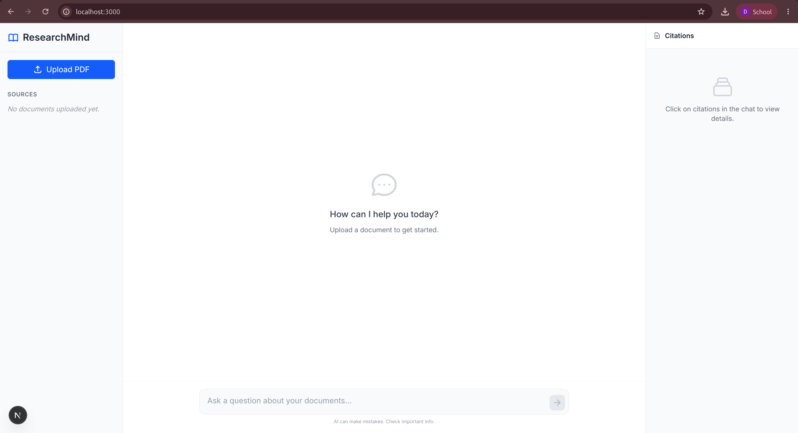
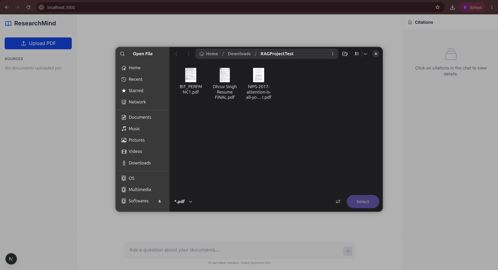
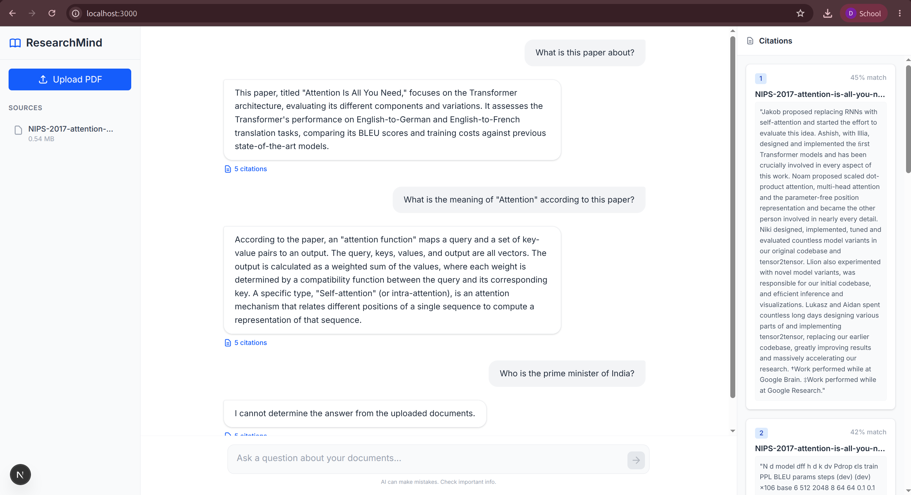
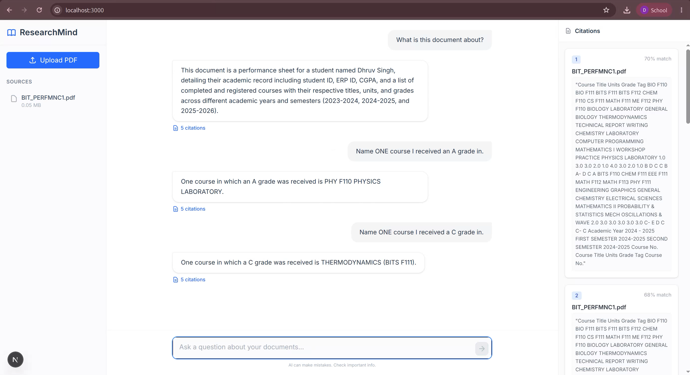
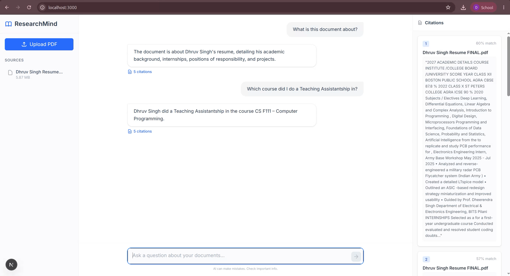

# ResearchMind AI 🧠

ResearchMind AI is an open-source and production-ready Retrieval-Augmented Generation (RAG) application. It allows you to upload PDF documents, intelligently chunk and embed their contents, and interact with an AI assistant grounded exclusively in your uploaded research. 

Every response includes direct citations, pointing exactly to the source document and page number.

## 📸 Screenshots

### Home



---

### Upload Document



---

### Chat with ResearchMind AI





---


## ✨ Features

- **PDF Upload & Ingestion**: Safely upload PDF documents into a local, isolated session.
- **Semantic Chunking**: Automatically extracts text and splits it into semantically meaningful, overlapping chunks.
- **Vector Embeddings**: Uses `BAAI/bge-small-en-v1.5` to generate high-quality text embeddings.
- **Similarity Search**: Powered by PostgreSQL and the `pgvector` extension for lightning-fast semantic retrieval.
- **Gemini-Powered RAG**: Integrates with the Google Gemini API to generate accurate, natural language answers.
- **Grounded Responses**: The AI is strictly instructed to only answer from the uploaded context, minimizing hallucinations.
- **Transparent Citations**: Answers include clickable citations detailing the document name, exact page number, and similarity score.
- **Document Management**: Easily manage your workspace with clean, cascading document deletion.

---

## 🏗 Architecture

```text
       Browser
          ↓
  Next.js Frontend
          ↓
   FastAPI Backend
          ↓
    PDF Processing
          ↓
  Semantic Chunking
          ↓
 Embedding Generation
          ↓
PostgreSQL + pgvector
          ↓
  Similarity Search
          ↓
     Gemini API
          ↓
Grounded Answer + Citations
```

---

## 🛠 Tech Stack

- **Frontend**: Next.js (App Router), React, TypeScript, Tailwind CSS
- **Backend**: FastAPI, Python 3.11+, SQLAlchemy, Alembic, Pydantic
- **Database**: PostgreSQL with `pgvector`
- **AI**: Google Gemini API, sentence-transformers
- **Infrastructure**: Docker, Docker Compose

---

## 📂 Project Structure

```text
researchmind-ai/
├── backend/                  # FastAPI Backend Services
│   ├── alembic/              # Database migration scripts
│   ├── app/
│   │   ├── api/              # RESTful route definitions
│   │   ├── core/             # Configuration, Gemini, and Embedding singletons
│   │   ├── models/           # SQLAlchemy ORM models
│   │   ├── repositories/     # Data access layer (pgvector queries)
│   │   ├── schemas/          # Pydantic validation schemas
│   │   ├── services/         # Core business logic (RAG, Chat, Ingestion)
│   │   └── utils/            # PDF extraction and semantic chunking
│   ├── Dockerfile            # Backend container definition
│   └── requirements/         # Pip dependency files
├── frontend/                 # Next.js Frontend Application
│   ├── src/
│   │   ├── app/              # Next.js App Router (Layout & Page)
│   │   ├── components/       # UI Components (Sidebar, ChatBox, Citations)
│   │   └── lib/              # Context Providers and API networking
│   ├── Dockerfile            # Frontend container definition
│   └── tailwind.config.ts    # Tailwind styling configuration
├── docker-compose.yml        # Multi-container orchestration
└── .env.secrets.example      # Example environment variables
```

---

## 🚀 Installation

Ensure you have Docker and Docker Compose installed on your machine. Docker is the officially supported and recommended method for running ResearchMind AI.

### 1. Clone the repository
```bash
git clone https://github.com/yourusername/researchmind-ai.git
cd researchmind-ai
```

### 2. Configure Environment Variables
You need to set up environment variables for both the backend and frontend.

**Backend:**
```bash
cp backend/.env.example .env.secrets
```
Edit `.env.secrets` and insert your Google Gemini API key:
```env
GEMINI_API_KEY=your_gemini_api_key_here
```

**Frontend:**
```bash
cp frontend/.env.example frontend/.env
```
*(The defaults in the frontend `.env.example` will work perfectly for local Docker development).*

### 3. Start the Application
Build and start all services using Docker Compose:
```bash
docker compose up --build -d
```

### 4. Open the App
- **Frontend UI**: http://localhost:3000
- **Backend API Docs (Swagger)**: http://localhost:8000/docs
- **Backend Health Check**: http://localhost:8000/health

---

## 🔐 Environment Variables

### Backend (`.env.secrets`)
| Variable | Description | Example / Default |
|----------|-------------|-------------------|
| `GEMINI_API_KEY` | **Required.** Your Google Gemini API key used for RAG generation. | `AIzaSy...` |
| `GEMINI_MODEL_NAME` | The Gemini model to use. | `gemini-2.5-flash` |
| `POSTGRES_USER` | PostgreSQL admin username. | `researchmind` |
| `POSTGRES_PASSWORD` | PostgreSQL admin password. | `researchmind` |
| `POSTGRES_DB` | PostgreSQL database name. | `researchmind` |
| `DATABASE_URL` | Full SQLAlchemy connection string. | `postgresql+psycopg://...` |
| `MAX_UPLOAD_SIZE_MB` | Maximum allowed PDF size in megabytes. | `50` |
| `CHUNK_SIZE` | Target character length for semantic text chunks. | `1000` |
| `CHUNK_OVERLAP` | Character overlap between adjacent chunks. | `200` |
| `EMBEDDING_MODEL_NAME` | HuggingFace model used for vector embeddings. | `BAAI/bge-small-en-v1.5` |
| `CHAT_TOP_K` | Number of chunks to retrieve for the LLM context. | `5` |

### Frontend (`frontend/.env`)
| Variable | Description | Example / Default |
|----------|-------------|-------------------|
| `NEXT_PUBLIC_API_BASE_URL` | URL where the frontend browser contacts the backend. | `http://localhost:8000/api/v1` |
| `INTERNAL_API_BASE_URL` | URL where the Next.js server contacts the backend. | `http://backend:8000/api/v1` |

---

## 📡 API Endpoints

### `GET /api/v1/documents`
Lists all uploaded documents currently in the system.
**Response:** `200 OK`
```json
[
  {
    "id": 1,
    "original_filename": "attention_is_all_you_need.pdf",
    "page_count": 15,
    "chunk_count": 42,
    "status": "COMPLETED"
  }
]
```

### `POST /api/v1/documents/upload`
Uploads a PDF, extracts text, generates semantic chunks, computes embeddings, and stores them in pgvector.
**Payload:** `multipart/form-data` containing `file`
**Response:** `201 Created`

### `DELETE /api/v1/documents/{document_id}`
Deletes a document, including cascading deletion of all associated chunks, embeddings, and the physical PDF file.
**Response:** `204 No Content`

### `POST /api/v1/chat`
Submits a query, performs a vector similarity search across the specified documents, and streams a grounded answer from Gemini with citations.
**Payload:**
```json
{
  "question": "What is self-attention?",
  "document_ids": [1],
  "top_k": 5
}
```
**Response:** `200 OK`

---

## 🔮 Future Improvements

While ResearchMind AI is feature-complete for its primary RAG use case, potential future enhancements could include:
- **Authentication**: Implementing user accounts and JWTs to isolate workspaces.
- **Multi-user Support**: Allowing multiple users to collaborate on shared document collections.
- **Chat History**: Persisting chat sessions and conversational memory to the database.
- **OCR Support**: Integrating Tesseract to extract text from scanned, non-searchable PDFs.
- **Document Collections**: Grouping uploaded documents into specific folders or tags.

*(Note: These are speculative ideas for community contributions, not currently on the core roadmap).*

---

## 📄 License

This project is licensed under the MIT License - see the [LICENSE](LICENSE) file for details.
